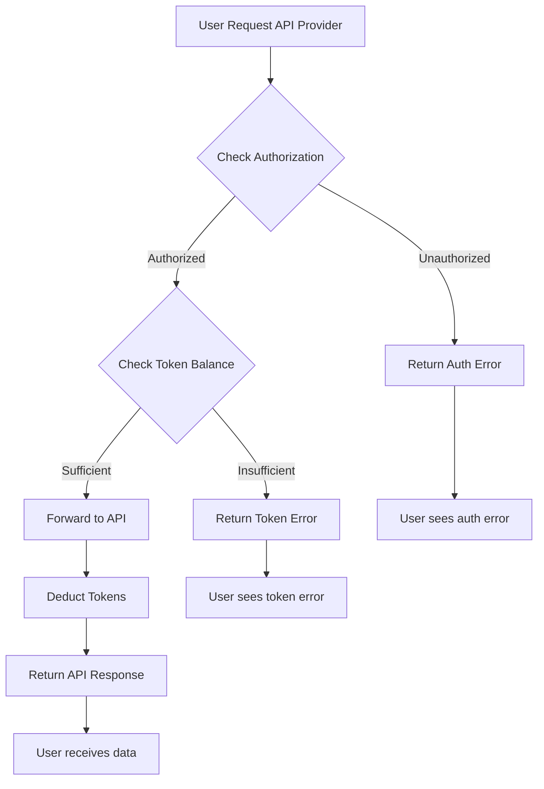

import {
  Callout,
  Cards,
  Table,
  Tabs
} from 'nextra/components';

# API Provider Overview

<Callout type="warning">
  This feature only available when paywall is in client mode and has tokenization enabled. [Learn more](/docs-v2/paywall/tokenization) about paywall tokenization.
</Callout>

Learn about API providers and how they enable integration of external APIs with your tokenized paywalls.

## What is an API Provider?

An API provider is a configuration that connects your paywall to an external API endpoint. When users make requests through the API provider, the system:

1. **Checks authorization** - Verifies user is authenticated and authorized
2. **Checks token balance** - Verifies user has sufficient tokens
3. **Forwards request** - Sends request to the target API endpoint
4. **Deducts tokens** - Charges based on the configured query price level
5. **Returns response** - Passes API response back to the user

## Key Features

API providers allow you to:

- **Connect external APIs** - Integrate third-party services into your monetization flow
- **Control access** - Manage user permissions based on token availability
- **Dynamic parameters** - Pass custom headers, body, and URL parameters
- **Automatic billing** - Charge users based on API usage and query complexity

## How It Works



## Configuration Examples

### OpenAI API Integration

<Tabs items={['Basic Setup', 'Advanced Configuration']}>
  <Tabs.Tab>
    **Basic OpenAI API Provider:**
    
    - **Name:** OpenAI GPT-4 API
    - **Query Price Level:** Advanced (expensive AI operations)
    - **Endpoint URL:** `https://api.openai.com/v1/chat/completions`
    - **Method:** POST
    - **Headers:**
      ```json
      {
        "Authorization": "Bearer sk-your-openai-key",
        "Content-Type": "application/json"
      }
      ```
    - **Body:**
      ```json
      {
        "model": "gpt-4",
        "max_tokens": 150
      }
      ```
    
  </Tabs.Tab>
  <Tabs.Tab>
    **Advanced Configuration with Dynamic Parameters:**
    
    Users can override default settings:
    - **Dynamic headers** - Pass custom Authorization tokens
    - **Extended body** - Add messages, temperature, etc.
    - **URL parameters** - Append additional endpoints
    
    This allows flexibility while maintaining base configuration.
    
  </Tabs.Tab>
</Tabs>

### Translation Service

**Google Translate API Provider:**

- **Name:** Google Translate API
- **Query Price Level:** Standard (moderate cost operation)
- **Endpoint URL:** `https://translation.googleapis.com/language/translate/v2`
- **Method:** POST
- **Headers:**
  ```json
  {
    "Authorization": "Bearer your-google-token",
    "Content-Type": "application/json"
  }
  ```

### Image Processing

**AI Image Enhancement API Provider:**

- **Name:** AI Image Enhancement
- **Query Price Level:** Advanced 2 (high-cost GPU processing)
- **Endpoint URL:** `https://api.imageenhance.com/v1/enhance`
- **Method:** POST
- **Headers:**
  ```json
  {
    "API-Key": "your-api-key",
    "Content-Type": "multipart/form-data"
  }
  ```

## Dynamic Parameters

API providers support dynamic parameters that users can pass at runtime:

### Request Headers

Users can add or override headers:

```javascript
// Additional headers passed by user
{
  "Custom-Header": "user-specific-value",
  "Authorization": "Bearer user-token"
}
```

### Request Body

Users can extend or modify the request body:

```javascript
// User extends the base body configuration
{
  "messages": [{"role": "user", "content": "Hello"}],
  "temperature": 0.7
}
```

### URL Pathname

Users can append additional path segments to the API provider's base URL. This allows accessing different endpoints of the same API.

#### How it works

When you configure an API provider, you specify a **base URL**. Users can then add additional paths to it when making requests.

**Example API provider configuration:**
- Base URL: `https://api.example.com/v1/users`

**How users add paths:**

Simply append the additional path directly to the API provider URL. The system will automatically forward this path to the target API endpoint.

<Tabs items={['JavaScript/Fetch', 'cURL', 'Python']}>
  <Tabs.Tab>
    ```javascript
    // Request to base endpoint
    fetch('https://appbox.space/api/v1/api-gateway/your-provider-id', {
      method: 'POST',
      body: JSON.stringify({
        // Your request data here
      })
    });
    // Goes to: https://api.example.com/v1/users

    // Request with additional path - append to provider URL
    fetch('https://appbox.space/api/v1/api-gateway/your-provider-id/profile/settings', {
      method: 'POST',
      body: JSON.stringify({
        // Your request data here
      })
    });
    // Goes to: https://api.example.com/v1/users/profile/settings

    // Another example with user ID and orders
    fetch('https://appbox.space/api/v1/api-gateway/your-provider-id/123/orders', {
      method: 'GET'
    });
    // Goes to: https://api.example.com/v1/users/123/orders
    ```
  </Tabs.Tab>
  <Tabs.Tab>
    ```bash
    # Request to base endpoint
    curl -X POST https://your-paywall.comhttps://appbox.space/api/v1/api-gateway/your-provider-id \
      -H "Content-Type: application/json" \
      -d '{"key": "value"}'

    # Request with additional path - append to provider URL
    curl -X POST https://your-paywall.comhttps://appbox.space/api/v1/api-gateway/your-provider-id/profile/settings \
      -H "Content-Type: application/json" \
      -d '{"key": "value"}'

    # GET request with path
    curl -X GET https://your-paywall.comhttps://appbox.space/api/v1/api-gateway/your-provider-id/123/orders
    ```
  </Tabs.Tab>
  <Tabs.Tab>
    ```python
    import requests

    # Request to base endpoint
    response = requests.post(
        'https://your-paywall.comhttps://appbox.space/api/v1/api-gateway/your-provider-id',
        json={'key': 'value'}
    )

    # Request with additional path - append to provider URL
    response = requests.post(
        'https://your-paywall.comhttps://appbox.space/api/v1/api-gateway/your-provider-id/profile/settings',
        json={'key': 'value'}
    )

    # GET request with path
    response = requests.get(
        'https://your-paywall.comhttps://appbox.space/api/v1/api-gateway/your-provider-id/123/orders'
    )
    ```
  </Tabs.Tab>
</Tabs>

**1. OpenAI API with different endpoints:**
```javascript
// Provider base URL: https://api.openai.com/v1
// Provider ID: openai-provider

// Chat with GPT-4
fetch('https://appbox.space/api/v1/api-gateway/openai-provider/chat/completions', {
  method: 'POST',
  body: JSON.stringify({
    model: 'gpt-4',
    messages: [...]
  })
})
// → https://api.openai.com/v1/chat/completions

// Image generation
fetch('https://appbox.space/api/v1/api-gateway/openai-provider/images/generations', {
  method: 'POST',
  body: JSON.stringify({
    prompt: 'A beautiful sunset',
    n: 1
  })
})
// → https://api.openai.com/v1/images/generations

// File operations
fetch('https://appbox.space/api/v1/api-gateway/openai-provider/files')
// → https://api.openai.com/v1/files
```

## Best Practices

### Security

1. **Secure API key storage** - Store API keys directly in the provider settings on our servers. Never send API keys from client-side code or expose them in frontend applications. This ensures your credentials remain secure and are only used for server-to-server communication.

### Token Management

2. **Choose appropriate query price levels** - Match the cost of the API operation with the token type
3. **Monitor usage patterns** - Track which APIs consume the most tokens
4. **Set reasonable limits** - Configure appropriate token deduction rates

### Performance

5. **Cache responses when possible** - Reduce API calls and token consumption
6. **Use appropriate timeouts** - Prevent hanging requests
7. **Handle errors gracefully** - Provide meaningful error messages to users

## Next Steps

<Cards>
  <Cards.Card 
    title="Create API Provider" 
    href="/docs-v2/api-provider/create-api-provider"
  />
  <Cards.Card 
    title="Enable Tokenization" 
    href="/docs-v2/paywall/tokenization"
  />
  <Cards.Card 
    title="Request API Provider" 
    href="/docs-v2/paywall-api/make-request"
  />
</Cards>
