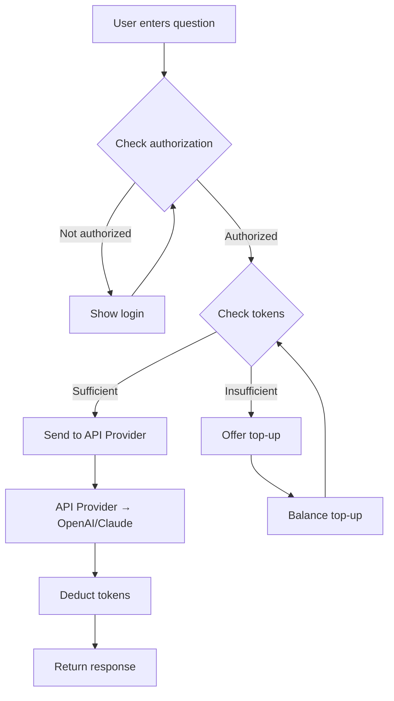

import { Steps, Cards, Callout, Tabs } from 'nextra/components';

# AI Chat with Pay-per-Request

Step-by-step guide to creating an AI chat with token-based monetization. Users pay for each AI request, allowing fair distribution of API costs and revenue generation.

<Callout type="info">
  **Complexity:** Intermediate  
  **Perfect for:** AI tools, chatbots, content generators
</Callout>

## What We'll Build

In this guide, you'll set up:

- ✅ Tokenized paywall with different request types
- ✅ AI API Provider for OpenAI/Claude integration
- ✅ Automatic token deduction for requests
- ✅ Balance top-up system
- ✅ Chat interface with balance checking

## Solution Architecture



---
## Setting up Payment Infrastructure

<Steps>

### Step 1: [Create paywall](/docs-v2/payment-processor/create-payment-processor)
Create Tokenized Paywall

### Step 2: [Create payment processor](/docs-v2/payment-processor/create-payment-processor)

### Step 3: [Connect payment processor to paywall](/docs-v2/payment-processor/connect-payment-processor)

### Step 4: [Install client-side SDK](/docs-v2/paywall-api/install-paywall)

</Steps>

## Setting up AI API Provider

<Steps>

### Step 4: Create API Provider

1. Go to **"API Providers"** → **"New API Provider"**
2. Fill in OpenAI configuration:

**Basic OpenAI Setup:**
```json
Name: OpenAI GPT-4 Chat
URL: https://api.openai.com/v1/chat/completions
Method: POST
Query Price Level: Standard

Headers:
{
  "Authorization": "Bearer YOUR_OPENAI_API_KEY",
  "Content-Type": "application/json"
}

Body:
{
  "model": "gpt-4",
  "max_tokens": 500,
  "temperature": 0.7
}
```

### Step 5: Configure Different Request Levels

Create multiple API Providers for different request types:

<Tabs items={['Basic Chat', 'Code Generation']}>
  <Tabs.Tab>
    **OpenAI Basic Chat:**
    ```json
    Query Price Level: Basic
    Body: {
      "model": "gpt-3.5-turbo",
      "max_tokens": 150,
      "temperature": 0.7
    }
    ```
  </Tabs.Tab>
  <Tabs.Tab>
    **OpenAI Code Generation:**
    ```json
    Query Price Level: Advanced
    Body: {
      "model": "gpt-4",
      "max_tokens": 2000,
      "temperature": 0.2
    }
    ```
  </Tabs.Tab>
</Tabs>

<Callout type="warning">
  **Security:** Never expose API keys in frontend code. They should only be stored in API Provider settings on monetize.software servers.
</Callout>

</Steps>

---

## Creating Chat Interface

<Steps>

### React Chat Example

For your actual application, use this full-featured version with real paywall integration:

```jsx
// components/AIChat.js
import React, { useState, useEffect, useRef } from 'react';

// URL configuration for different AI models
const model2url = {
  haiku: `https://appbox.space/api/v1/api-gateway/{{YOUR_API_PROVIDER_ID}}?paywall_id={{YOUR_API_PAYWALL_ID}}`,
  sonnet: `https://appbox.space/api/v1/api-gateway/{{YOUR_API_PROVIDER_ID}}?paywall_id={{YOUR_API_PAYWALL_ID}}`,
  opus: `https://appbox.space/api/v1/api-gateway/{{YOUR_API_PROVIDER_ID}}?paywall_id={{YOUR_API_PAYWALL_ID}}`
};

const model2type = {
  haiku: 'standard',
  sonnet: 'advanced',
  opus: 'advanced'
};

export default function AIChat() {
  const [user, setUser] = useState();
  const [messages, setMessages] = useState([]);
  const [answer, setAnswer] = useState('');
  const [isLoading, setIsLoading] = useState(false);
  const [prompt, setPrompt] = useState('');
  const [selectedModel, setSelectedModel] = useState('sonnet');
  const abortSignal = useRef({ abort: () => {} });
  
  const getUser = async () => {
    const user = await paywall.getUser();
    setUser(user);
  };

  useEffect(() => {
    getUser();
  }, []);
  
  const onSendMessage = async () => {
    if (isLoading) {
      abortSignal.current?.abort();
      setIsLoading(false);
      return;
    }

    if (user?.error) {
      await paywall.open({ resolveEvent: 'signed-in' });
      getUser();
      return;
    }

    setAnswer('');
    setIsLoading(true);
    setPrompt('');
    
    const newMessages = [
      ...messages,
      {
        role: 'user',
        content: prompt
      }
    ]

    setMessages(newMessages);
    
    let fullAnswer = '';

    try {
      for await (const chunk of paywall.makeStreamRequest(model2url[selectedModel], {
        method: 'POST',
        body: JSON.stringify({
          messages: newMessages,
          stream: true
        }),
        abortSignal.current
      })) {
        try {
          const lines = chunk
            .split('\n')
            .filter((line) => line.startsWith('data: '));

          lines.forEach((line) => {
            const data = line.replace('data: ', '').trim();
            try {
              const parsed = JSON.parse(data);
              const content = parsed.choices[0].delta.content;
              if (content) {
                fullAnswer += content;
                setAnswer((prev) => prev + content);
              }
            } catch (error) {
              console.error('Failed to parse SSE data:', error);
            }
          });
        } catch (error) {
          console.error('Failed to parse SSE data:', error);
        }
      }
      
      setMessages((prev) => [
        ...prev,
        {
          role: 'assistant',
          content: fullAnswer
        }
      ]);

      // Charge user queries 
      setUser((user) => ({
        ...user,
        balances: user?.balances?.map((balance) =>
          balance.type === model2type[selectedModel]
            ? { type: balance.type, count: balance.count - 1 }
            : balance
        )
      }));
    } catch (error) {
      if (error === 'not-enough-queries') {
        // User queries have run out, ask to renew subscription to top up again
        setIsLoading(false);
        await paywall.renew();
        // Update user balances after success payment
        await getUser();
      } else if (error === 'Unauthorized' || error === 'access-denied') {
        setIsLoading(false);
        await paywall.open({ resolveEvent: 'signed-in' });
        // Update user balances after success login
        await getUser();
      }
    }

    setIsLoading(false);
  };
  
  return (
    <div className="chat-container">
      {/* Model selector */}
      <div className="model-selector">
        <select 
          value={selectedModel} 
          onChange={(e) => setSelectedModel(e.target.value)}
          disabled={isLoading}
        >
          <option value="haiku">Claude 4 Haiku (Standard)</option>
          <option value="sonnet">Claude 4 Sonnet (Advanced)</option>
          <option value="opus">Claude 4 Opus (Advanced)</option>
        </select>
      </div>

      {/* Chat messages */}
      <div className="chat-messages">
        {messages.map((message, index) => (
          <div key={index} className={`message ${message.role}`}>
            <strong>{message.role === 'user' ? 'You' : 'AI Assistant'}:</strong>
            <br />
            <span>{message.content}</span>
          </div>
        ))}
        {isLoading && (answer || "Loading answer...")}
      </div>

      {/* Input area */}
      <div className="input-container">
        <textarea 
          onChange={(e) => setPrompt(e.target.value)} 
          value={prompt} 
          placeholder="Write your question" 
          disabled={isLoading}
          rows="3"
        />
        <button onClick={onSendMessage} disabled={!prompt.trim() && !isLoading}>
          {isLoading ? 'Stop' : 'Send message'}
        </button>
      </div>

      {/* Balance display */}
      {user?.balances && (
        <div className="balance-display">
          Your balance:
          {
            user?.balances?.find(
              (balance) =>
                balance.type === model2type[selectedModel]
            )?.count
          }{' '}
          Queries
        </div>
      )}
    </div>
  );
}
```

</Steps>

## Next Steps

After successfully launching your AI chat, consider adding:

<Cards>
  <Cards.Card 
    title="Create Offer" 
    href="/docs-v2/offers/overview"
  />
</Cards>

Congratulations! You've created a fully functional AI chat with monetization. Users can now get quality AI responses while you fairly monetize your service. Now you can connect live payment processor to paywall and start accepting real payments.

