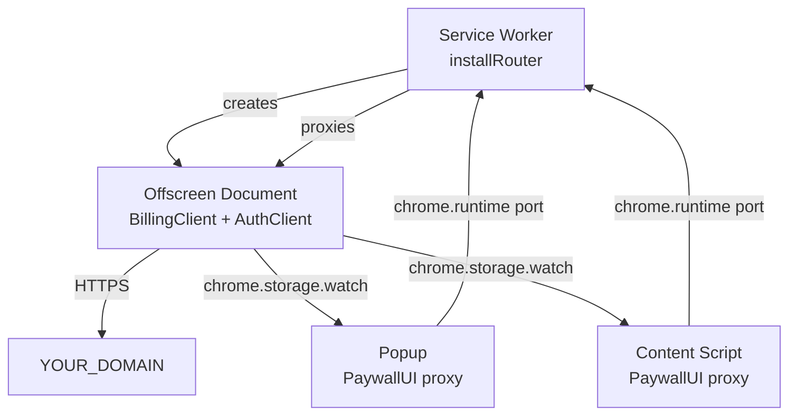

import { Steps, Cards, Callout, Tabs } from 'nextra/components';

# Chrome Extension with SDK 3.0

End-to-end guide for monetizing a **Manifest V3 Chrome extension** using `@monetize.software/sdk-extension`. Bundled npm package — passes CWS review (no remote code, no iframe), shares a single auth/bootstrap state across popup, content scripts, and service worker via an offscreen document.

<Callout type="info">
  **Complexity:** Intermediate
  **Perfect for:** Chrome / Edge / Firefox MV3 extensions with paid features, browser-side AI assistants, productivity tools
  **Time:** ~30 minutes
</Callout>

## What We'll Build

- Extension with popup + content script + service worker, all sharing one user session
- Premium feature gated behind a paywall — opens in the popup, unlock visible everywhere
- Trial counter that decrements across tabs without re-fetching
- Manifest tuned for CWS review (minimal `host_permissions`, no `web_accessible_resources` hack)
- Webhook handler on your backend to sync subscription state

## Why a Separate Package?

A standalone `@monetize.software/sdk` instance in each context (popup, content, SW) would mean three independent auth sessions, three bootstrap fetches, three trial counters. Users would have to log in every time they opened the popup. `@monetize.software/sdk-extension` solves this by running **one** SDK instance inside an offscreen document; popup and content scripts proxy calls to it through `chrome.runtime` ports.

## Architecture



All state lives in the offscreen document. Popup/content render UI; SW is a thin router.

## Set Up the Paywall

<Steps>

### Create the paywall

[Create a paywall](/docs-v2/paywall/create-paywall) and pick **SDK 3.0** as the SDK version. The same paywall works in any browser context (popup, content script, options page) — SDK 3.0 paywalls have no Client / Server mode toggle.

### Add a payment processor

[Create a payment processor](/docs-v2/payment-processor/create-payment-processor) and [connect it](/docs-v2/payment-processor/connect-payment-processor). For extensions, Paddle is often easier (handles VAT/sales tax for digital goods).

### Note your `paywallId`

</Steps>

## Integrate the SDK

<Steps>

### Install

```bash
pnpm add @monetize.software/sdk-extension preact
```

`preact` is a peer dependency — extensions need an explicit copy in their bundle.

### Manifest

```json
{
  "manifest_version": 3,
  "name": "My Extension",
  "version": "1.0.0",
  "permissions": ["offscreen", "storage"],
  "host_permissions": ["https://YOUR_DOMAIN/*"],
  "background": { "service_worker": "sw.js", "type": "module" },
  "action": { "default_popup": "popup.html" }
}
```

Add `"identity"` if you enable OAuth in the paywall. Add `"content_scripts"` only if you render the paywall on third-party sites.

<Callout type="warning">
  **Do NOT set `host_permissions: ["<all_urls>"]`** unless your extension genuinely needs to inject content on every site. CWS reviewers manually audit `<all_urls>` extensions, and AV vendors (Avast, Kaspersky) flag them. The SDK itself only needs your API origin.
  See [host_permissions deep-dive](/docs-v2/sdk-v3/installation#host_permissions--что-выбрать).
</Callout>

<Callout type="warning">
  **Do NOT add `offscreen.html` to `web_accessible_resources`.** Offscreen documents are created via `chrome.offscreen.createDocument` — a chrome-API call, not a `<iframe src>`. Listing it makes your extension fingerprintable from any page and exposes it to embedding attacks.
</Callout>

### Service Worker — `sw.js`

```ts
import { installRouter } from '@monetize.software/sdk-extension/sw';

installRouter({
  offscreenUrl: chrome.runtime.getURL('offscreen.html')
});
```

That's the entire SW. The router lazily creates the offscreen document the first time popup/content sends a message, and proxies subsequent calls.

### Offscreen — `offscreen.html` loads `offscreen.js`

```html
<!-- offscreen.html -->
<!doctype html>
<script type="module" src="offscreen.js"></script>
```

```ts
// offscreen.ts
import { startOffscreenServer } from '@monetize.software/sdk-extension/offscreen';

startOffscreenServer({
  paywallId: '3',
  apiOrigin: 'https://YOUR_DOMAIN',
  auth: true
});
```

All HTTP, storage and auth-refresh happens here. Popup/content never touch the network directly.

### Popup — `popup.ts`

```ts
import { PaywallUI } from '@monetize.software/sdk-extension';

const paywall = new PaywallUI({
  paywallId: '3',
  apiOrigin: 'https://YOUR_DOMAIN',
  auth: true
});

document.getElementById('upgrade')!.addEventListener('click', () => paywall.open());

paywall.on('purchase_completed', ({ priceId }) => {
  // popup will close shortly after; the unlock is already in storage
});

paywall.on('authChange', ({ event, session }) => {
  if (event === 'SIGNED_IN') {
    // user just signed in — refresh popup UI
  }
  // INITIAL_SESSION fires once per subscriber after the popup mounts — use it
  // to paint the restored state, not as a signal that something just changed.
});
```

### Gate a premium feature in a content script

```ts
// content-script.ts
import { PaywallUI } from '@monetize.software/sdk-extension';

const paywall = new PaywallUI({
  paywallId: '3',
  apiOrigin: 'https://YOUR_DOMAIN',
  auth: true
});

async function onPremiumAction() {
  const user = await paywall.billing.getUser();
  if (user.has_active_subscription) {
    runPremiumFlow();
    return;
  }
  paywall.open(); // same flow as popup; result is shared
}
```

A purchase from the popup is visible here on the next `paywall.billing.getUser()` call (and via `userChange` event). No reload needed.

</Steps>

## Sync Subscriptions on Your Backend

Same shape as web — see [SaaS Web guide → backend webhooks](/docs-v2/guide/sdk-v3-web#sync-subscriptions-on-your-backend). The only extension-specific note: don't try to persist the canonical user state in `chrome.storage` — Chrome wipes extension storage on uninstall/reinstall and on profile switches. Treat the backend (driven by webhooks) as the source of truth.

## CWS Review Checklist

Submitting to the Chrome Web Store with paid features attracts extra scrutiny.

- [ ] `host_permissions` is the **narrowest** set you actually use — your custom paywall domain for backend, plus specific domains if you have content scripts
- [ ] Privacy policy link in the listing covers payment data, email collection, and analytics
- [ ] “Permission justification” fields explain *each* permission with a user-facing reason
- [ ] You don't list `offscreen.html` (or any internal page) in `web_accessible_resources`
- [ ] No remote code execution: all paywall logic ships bundled in your `.zip` — the SDK 3.0 enforces this
- [ ] Single Purpose declaration matches what the extension does (not “monetize stuff”)
- [ ] You test the trial flow with a fresh profile, then a profile that already used the trial

## Production Checklist

- [ ] You handle the offscreen-document lifecycle (Chrome can recycle it; `installRouter` re-creates on demand)
- [ ] Webhook handler in your backend writes to a DB the extension's backend can query — `chrome.storage` is **not** the source of truth
- [ ] If you use trials: backend webhook on `subscription.created` (with `status: trialing`) is what actually starts the trial clock, not the extension
- [ ] You unsubscribe from `paywall.on(...)` listeners when the popup closes (DOMContentUnload)

## Next Steps

<Cards>
  <Cards.Card title="Installation deep dive" href="/docs-v2/sdk-v3/installation" description="Permissions, manifest variants, Telegram Mini App" />
  <Cards.Card title="BillingClient" href="/docs-v2/sdk-v3/bootstrap" description="Cross-context sync via storage.watch" />
  <Cards.Card title="Security" href="/docs-v2/sdk-v3/security" description="Token storage in extension contexts" />
  <Cards.Card title="Authentication" href="/docs-v2/sdk-v3/auth" description="OAuth in extensions, identity permission" />
</Cards>
