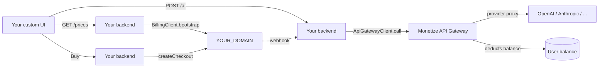

import { Steps, Cards, Callout, Tabs } from 'nextra/components';

# Headless Billing with SDK 3.0 (Server / Custom UI)

End-to-end guide for using SDK 3.0 **without the built-in UI**. You either render the paywall yourself or proxy AI calls from your backend. The same npm package as for the web — but you import only `@monetize.software/sdk/core` (≤ 8 KB gz, no Preact, no DOM).

<Callout type="info">
  **Complexity:** Advanced
  **Perfect for:** Apps with their own checkout UI, AI products with metered usage, mobile backends, server-to-server integrations
  **Time:** ~45 minutes
</Callout>

## What “Headless” Means Here

SDK 3.0 has three sub-exports of one package:

- `@monetize.software/sdk/ui` — `PaywallUI`, Shadow DOM modal (browser)
- `@monetize.software/sdk/core` — `BillingClient`, `AuthClient`, `ApiGatewayClient`, `EventTracker` (no UI, runs anywhere)
- `@monetize.software/sdk` — both at once

“Headless” = importing **only `/core`**. There is no separate “server-sdk” package and no `server_mode` flag in the dashboard — one `paywallId` serves UI, extension, and headless callers simultaneously.

## What We'll Build

- Server-side checkout: Node backend fetches prices, starts checkout via `BillingClient`, returns a checkout URL to your frontend
- Metered AI proxy: `ApiGatewayClient` forwards user requests to OpenAI/Anthropic and deducts tokens from the user's balance
- Custom upgrade UX: catch `QuotaExceededError`, show your own upgrade screen instead of the built-in modal
- Webhook sync so your DB knows who is paid

## Architecture



## Set Up the Paywall

<Steps>

### Create the paywall

[Create a paywall](/docs-v2/paywall/create-paywall) and pick **SDK 3.0** as the SDK version (no Client / Server mode toggle on SDK 3.0 — every paywall is usable headlessly via `BillingClient`). For metered AI you'll likely want **Tokenized** pricing — see [Tokenization](/docs-v2/paywall/tokenization).

### Add a payment processor

[Create a payment processor](/docs-v2/payment-processor/create-payment-processor) and [connect it](/docs-v2/payment-processor/connect-payment-processor).

### Add an API Provider (only for metered AI proxy)

In **API Providers** → **New API Provider** configure your upstream (OpenAI / Anthropic / custom). The dashboard issues a `providerId` (UUID) you'll pass to `ApiGatewayClient`. Set per-request token costs in the provider's settings.

### Note your IDs

You'll need `paywallId` (numeric, from paywall URL) and — for the gateway — `providerId` (UUID, from API Providers).

</Steps>

## Server-Side Checkout

The simplest headless scenario: your backend fetches prices and starts checkout on the user's behalf.

<Steps>

### Install

```bash
pnpm add @monetize.software/sdk
```

### Initialize on your backend

```ts
// server/billing.ts
import { BillingClient } from '@monetize.software/sdk/core';

// One instance per process. apiKey identifies you (the paywall owner);
// per-request identity is set just before the call (next step).
export const billing = new BillingClient({
  paywallId: process.env.MONETIZE_PAYWALL_ID!,
  apiOrigin: 'https://YOUR_DOMAIN',
  apiKey: process.env.MONETIZE_API_KEY! // server-only key from the dashboard
});
```

`apiKey` is generated in Dashboard → Settings → API keys. **Never put it in client code** — the SDK warns if it detects `window`.

<Callout type="info">
  **Bring-your-own auth.** You don't register users in monetize.software's auth — pass their `email` + your stable `userId` per request via `setIdentity` (next step). For endpoints that require Bearer (`listPurchases`, `cancelSubscription`), see [Per-user Bearer](/docs-v2/sdk-v3/headless-server#per-user-bearer).
</Callout>

### Expose prices to your frontend

```ts
// GET /api/prices
app.get('/api/prices', async (_req, res) => {
  const boot = await billing.bootstrap();
  res.json(
    boot.offers.flatMap((o) =>
      o.prices.map((p) => ({
        id: p.id,
        interval: p.interval,
        amount: p.amount,
        currency: p.currency
      }))
    )
  );
});
```

`bootstrap()` is cached — subsequent calls within ~10 minutes hit memory, not the network.

### Start a checkout

```ts
// POST /api/checkout
app.post('/api/checkout', async (req, res) => {
  const user = await yourAuth.requireUser(req); // your own session check

  // Bind this call to the user from your DB.
  billing.setIdentity({
    email: user.email,
    userId: user.id // your stable ID — used to map subscriptions back to your DB
  });

  const checkout = await billing.createCheckout({
    priceId: req.body.priceId,
    idempotencyKey: crypto.randomUUID() // mandatory for production
  });

  res.json({ url: checkout.url });
});
```

Your frontend redirects the user to `checkout.url`. Everything from there (card form, 3DS, success page) is hosted by the payment processor. The webhook (later in this guide) tells you when the subscription is active.

<Callout type="warning">
  **`billing` is a singleton — `setIdentity` mutates shared state.** In a long-running worker, call `setIdentity` immediately before `createCheckout` on each request. Don't rely on the previous request's identity sticking around. For multi-tenant or concurrent flows, instantiate a fresh `BillingClient` per request (per [Headless / server-side → Per-request](/docs-v2/sdk-v3/headless-server)).
</Callout>

</Steps>

## Metered AI Proxy with `ApiGatewayClient`

If you sell per-request AI access (chat, image gen, embedding), proxy the calls through Monetize's gateway. It deducts tokens, rejects when balance is empty, and works without `BillingClient`.

<Steps>

### Instantiate the gateway

```ts
// server/ai.ts
import { ApiGatewayClient, QuotaExceededError } from '@monetize.software/sdk/core';

const gateway = new ApiGatewayClient({
  paywallId: process.env.MONETIZE_PAYWALL_ID!,
  apiOrigin: 'https://YOUR_DOMAIN',
  userId: 'usr_external_123' // your stable user ID; sent as X-User-ID
});
```

`userId` is **headless-only** — it ships as the `X-User-ID` header. The same client used from a browser would emit a warning, because users could forge the header. Use `auth: <AuthClient>` (Bearer token) on the client.

### Proxy a single request

```ts
// POST /api/ai/chat
app.post('/api/ai/chat', async (req, res) => {
  try {
    const upstream = await gateway.call({
      providerId: process.env.MONETIZE_OPENAI_PROVIDER_ID!,
      path: '/v1/chat/completions',
      method: 'POST',
      body: {
        model: 'gpt-4o-mini',
        messages: req.body.messages
      }
    });

    // .call() returns the raw upstream Response — JSON, SSE, multipart, anything
    res.status(upstream.status);
    upstream.headers.forEach((v, k) => res.setHeader(k, v));
    upstream.body?.pipeTo(/* write to res */ res as any);
  } catch (err) {
    if (err instanceof QuotaExceededError) {
      return res.status(402).json({
        error: 'quota_exceeded',
        currentBalance: err.currentBalance
      });
    }
    throw err;
  }
});
```

### Stream responses

`.call()` returns a `Response`, so SSE / token streaming works without buffering:

```ts
const upstream = await gateway.call({
  providerId,
  path: '/v1/chat/completions',
  body: { model: 'gpt-4o', stream: true, messages }
});
return new Response(upstream.body, { headers: upstream.headers });
```

</Steps>

## Custom Upgrade UX on Quota Exceeded

In headless mode no modal pops up — your code decides what happens. Two patterns:

<Tabs items={['try/catch', 'onQuotaExceeded callback']}>
<Tabs.Tab>

```ts
import { QuotaExceededError } from '@monetize.software/sdk/core';

try {
  await gateway.call({ providerId, path, body });
} catch (err) {
  if (err instanceof QuotaExceededError) {
    // Return a 402 to your frontend; the frontend opens its own upgrade screen
    // and on confirm calls /api/checkout (above)
    return { needsUpgrade: true, currentBalance: err.currentBalance };
  }
  throw err;
}
```

</Tabs.Tab>
<Tabs.Tab>

```ts
const gateway = new ApiGatewayClient({
  paywallId,
  userId,
  onQuotaExceeded: (err) => {
    // Single point of telemetry / Slack alerting / ticket creation
    metrics.increment('quota_exceeded', { user: userId });
  }
});
```

The callback fires *in addition* to the thrown `QuotaExceededError` — useful for cross-cutting concerns.

</Tabs.Tab>
</Tabs>

## Sync Subscriptions on Your Backend

In headless mode webhooks are even more important — there's no UI event to fall back on.

<Steps>

### Subscribe to events

[Create a webhook](/docs-v2/webhooks/create-webhook) for `subscription.*`, `payment.completed`, `refund.created`. See [event payload reference](/docs-v2/webhooks/events).

### Verify and persist

```ts
import crypto from 'node:crypto';

app.post('/api/webhooks/monetize', express.raw({ type: 'application/json' }), (req, res) => {
  const sig = req.header('x-signature') ?? '';
  const expected = crypto
    .createHmac('sha256', process.env.MONETIZE_WEBHOOK_SECRET!)
    .update(req.body)
    .digest('hex');
  if (!crypto.timingSafeEqual(Buffer.from(sig), Buffer.from(expected))) {
    return res.status(401).send('bad signature');
  }

  const event = JSON.parse(req.body.toString());

  switch (event.type) {
    case 'subscription.created':
    case 'subscription.updated':
      upsertSubscription(event.data.user.id, event.data.subscription);
      break;
    case 'subscription.cancelled':
      markCancelled(event.data.user.id);
      break;
    case 'refund.created':
      reverseEntitlements(event.data.payment.id);
      break;
  }
  res.send('ok');
});
```

<Callout type="warning">
  **Idempotency.** Paddle can resend `subscription.updated` for the same subscription with identical data — your handler must be idempotent. Use the event's `id` as a dedup key in a small table.
</Callout>

</Steps>

## Production Checklist

- [ ] `paywallId`, `providerId`, API keys live in env vars / secret manager, never in code
- [ ] `userId` passed to `ApiGatewayClient` is **stable** for the lifetime of the customer — losing it means a new user with a new trial balance
- [ ] Quota errors return `402 Payment Required` to your frontend (not `500`)
- [ ] Webhook handler is idempotent and signature-verified
- [ ] Webhook handler responds `2xx` within 10s — heavy work (emails, syncs) goes to a queue
- [ ] You don't ship `userId` from your browser code — it's headless-only and forgeable from the client
- [ ] If you use streaming AI responses, your frontend handles partial failures (quota can run out mid-stream)

## Next Steps

<Cards>
  <Cards.Card title="API Gateway deep dive" href="/docs-v2/sdk-v3/api-gateway" description="Balance state, optimistic decrements, providers" />
  <Cards.Card title="BillingClient" href="/docs-v2/sdk-v3/bootstrap" description="Bootstrap, prices, checkout flow" />
  <Cards.Card title="Authentication" href="/docs-v2/sdk-v3/auth" description="AuthClient methods, anonymous sessions, OAuth" />
  <Cards.Card title="Storage adapters" href="/docs-v2/sdk-v3/storage" description="Backing storage for server / mobile / extension" />
  <Cards.Card title="Tokenization" href="/docs-v2/paywall/tokenization" description="Per-query pricing setup for AI products" />
  <Cards.Card title="Webhook events" href="/docs-v2/webhooks/events" description="Full event payload reference" />
</Cards>
