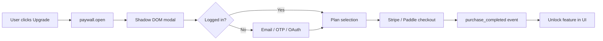

import { Steps, Cards, Callout, Tabs } from 'nextra/components';

# SaaS Subscription with SDK 3.0 (Web)

End-to-end guide for adding a subscription paywall to a web app / SPA using **SDK 3.0**. Bundled npm package, no iframe, Shadow DOM rendering, built-in auth.

<Callout type="info">
  **Complexity:** Beginner-to-Intermediate
  **Perfect for:** Web apps, SaaS dashboards, SPAs, marketing sites with a build step
  **Time:** ~20 minutes
</Callout>

## What We'll Build

- Paywall modal that opens on “Upgrade” click — no iframe, no layout conflicts
- Built-in email / OTP / OAuth login (managed by `AuthClient`)
- Subscription gate: check the user's plan on page load, show premium features only to paying users
- Reaction to `purchase_completed` — instantly unlock the feature without page reload

## Architecture



## Set Up the Paywall

<Steps>

### Create the paywall

[Create a paywall](/docs-v2/paywall/create-paywall) and pick **SDK 3.0** as the SDK version. SDK 3.0 paywalls have no separate Client / Server mode toggle — the SDK handles both the modal and headless flows.

### Add a payment processor

[Create a payment processor](/docs-v2/payment-processor/create-payment-processor) (Stripe / Paddle / Chargebee / Freemius), then [connect it to the paywall](/docs-v2/payment-processor/connect-payment-processor). Start in test mode.

### Add subscription plans

In the paywall settings, add at least one recurring plan (e.g. monthly + yearly). Mark one as recommended — it gets the highlight in the modal.

### Note your `paywallId`

Take the numeric ID from the paywall URL in the dashboard — you'll pass it to the SDK.

</Steps>

## Integrate the SDK

<Steps>

### Install

```bash
pnpm add @monetize.software/sdk
# or: npm i @monetize.software/sdk
```

### Initialize once at app boot

```ts
// src/paywall.ts
import { PaywallUI } from '@monetize.software/sdk/ui';

export const paywall = new PaywallUI({
  paywallId: '3',
  apiOrigin: 'https://YOUR_DOMAIN',
  auth: true // managed AuthClient: email + OTP + OAuth
});
```

`auth: true` is enough for most apps — the SDK creates an `AuthClient` internally, persists the session, and refreshes tokens. If your app already has its own login, you can pass user data into the SDK with [`billing.setIdentity({ email, userId })`](/docs-v2/sdk-v3/bootstrap#setidentityidentity--getidentity) or run the [headless flow](/docs-v2/guide/sdk-v3-headless) entirely from your backend.

### Open the modal

```ts
import { paywall } from './paywall';

document.getElementById('upgrade-btn')!.addEventListener('click', () => {
  paywall.open();
});
```

### Gate features by subscription

Use the `BillingClient` exposed on `paywall.billing` to read user state. It's bootstrapped lazily on first call and cached cross-tab via storage events.

```ts
import { paywall } from './paywall';

async function gateFeature() {
  const user = await paywall.billing.getUser();

  if (user.has_active_subscription) {
    enablePremium();
    return;
  }

  // Not subscribed — open paywall and wait for purchase
  paywall.open();
}
```

`user.has_active_subscription` is the coarse boolean — covers active subscription, lifetime payment, or active trial. For per-plan logic, walk `user.purchases` (each item has `id`, `status`, `current_period_end`, `cancel_at_period_end`). For renewal / cancel UI, use `billing.listPurchases()` — see [Customer portal](/docs-v2/sdk-v3/customer-portal).

For a side-effect-free check (no `bootstrap` call, no modal mount) prefer `paywall.getAccess()` — it returns a discriminated union `granted | blocked` with `reason: 'has_subscription' | 'trial_blocked' | 'visibility_blocked' | 'no_subscription'`:

```ts
const access = await paywall.getAccess();
if (access.access === 'granted') enablePremium();
else paywall.open();
```

### React to purchase

```ts
const unsubscribe = paywall.on('purchase_completed', ({ priceId, sessionId }) => {
  enablePremium();
  // Optional: tell your backend the user just paid, so you can pre-warm their workspace
  fetch('/api/post-purchase', {
    method: 'POST',
    body: JSON.stringify({ sessionId, priceId })
  });
});

paywall.on('close', () => {
  // user dismissed the modal without buying
});

paywall.on('error', (err) => {
  // network / config errors; payment failures come via 'purchase_failed'
  console.error(err);
});
```

`paywall.on()` returns an unsubscribe function — call it on component unmount. Full event list: [Events](/docs-v2/sdk-v3/events).

</Steps>

## Production Checklist

- [ ] `paywallId` and `apiOrigin` come from env vars, not hardcoded strings
- [ ] In dev you use a test paywall + test payment processor (separate `paywallId`)
- [ ] You unsubscribe from `paywall.on(...)` listeners on component unmount (React/Vue)
- [ ] `auth: true` matches your privacy policy — review where the SDK stores tokens ([Security](/docs-v2/sdk-v3/security))

<Callout type="info">
  **Need server-side subscription sync?** Webhooks are the source of truth for the database state — `purchase_completed` can be missed if the tab closes mid-checkout. See the [Headless guide → Sync Subscriptions on Your Backend](/docs-v2/guide/sdk-v3-headless#sync-subscriptions-on-your-backend) for the full handler.
</Callout>

## Next Steps

<Cards>
  <Cards.Card title="BillingClient API" href="/docs-v2/sdk-v3/bootstrap" description="Bootstrap cache, cross-tab sync, optimistic updates" />
  <Cards.Card title="PaywallUI API" href="/docs-v2/sdk-v3/ui" description="All events, options, state machine" />
  <Cards.Card title="Authentication" href="/docs-v2/sdk-v3/auth" description="Email / OTP / OAuth, anonymous sessions" />
  <Cards.Card title="Security" href="/docs-v2/sdk-v3/security" description="Token storage, CSRF, allowed origins" />
</Cards>
