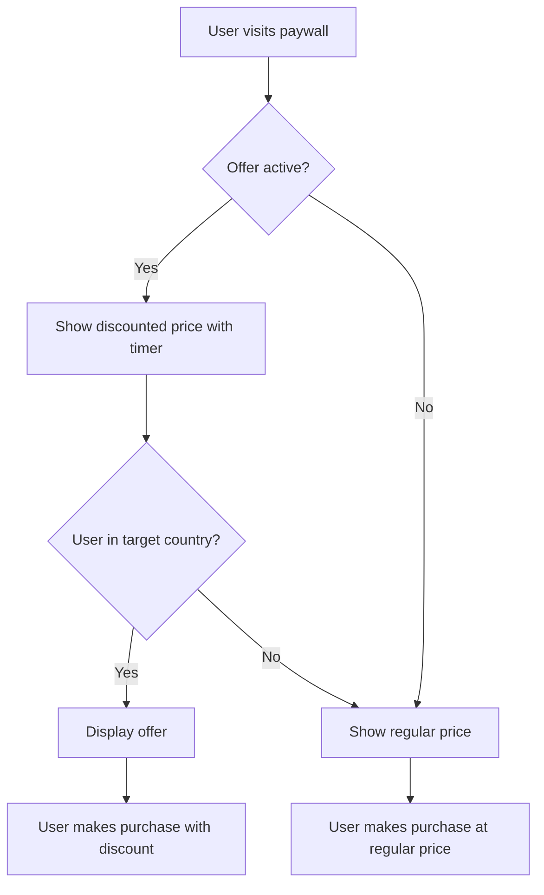

import {
  Callout,
  Cards,
  Table,
  Tabs
} from 'nextra/components';

# Offers Overview

Learn about discount offers and how they can boost conversions on your paywalls through strategic pricing and urgency.

<div style={{ marginTop: '2rem', marginBottom: '2rem', maxWidth: '400px' }}>
    
</div>

## What is an Offer?

An offer is a time-limited discount that appears on your paywall, encouraging users to make a purchase with reduced pricing. Offers can be configured with:

- **Discount percentage** (1-100%)
- **Timer settings** (duration or end date)
- **Geographic targeting** (specific countries/tiers)
- **Display customization** (title, appearance)

## Key Benefits

Offers allow you to:

- **Increase conversions** by providing urgency and incentives
- **Target specific audiences** with personalized deals
- **Boost revenue** through strategic pricing
- **Reduce abandonment** by offering last-chance discounts

## How Offers Work



## User Experience

When users see your offer:

1. **Offer appears** on the paywall with discount badge
2. **Timer starts counting down** (if duration-based)
3. **Discount applies** automatically at checkout
4. **Urgency increases** as timer approaches zero

## Timer Types

<Tabs items={['Duration Timer', 'End Date Timer']}>
  <Tabs.Tab>
    **Duration-based offers:**
    - Set specific duration in minutes
    - Offer expires after the set time from when user first sees it
    - Range: 1 minute to 7 days (10,080 minutes)
    - Best for: Personal urgency, flash sales
  </Tabs.Tab>
  <Tabs.Tab>
    **End date offers:**
    - Set specific end date and time
    - Offer expires at the exact datetime specified
    - Must be in the future
    - Best for: Campaigns, seasonal promotions
  </Tabs.Tab>
</Tabs>

## Geographic Targeting

Target specific audiences based on their location:

<Table>
  <thead>
    <Table.Tr>
      <Table.Th>Tier</Table.Th>
      <Table.Th>Countries</Table.Th>
      <Table.Th>Strategy</Table.Th>
    </Table.Tr>
  </thead>
  <tbody>
    <Table.Tr>
      <Table.Td>**Tier 1**</Table.Td>
      <Table.Td>US, UK, Canada, Australia, etc.</Table.Td>
      <Table.Td>Lower discounts, higher margins</Table.Td>
    </Table.Tr>
    <Table.Tr>
      <Table.Td>**Tier 2**</Table.Td>
      <Table.Td>European countries, Japan, etc.</Table.Td>
      <Table.Td>Moderate discounts</Table.Td>
    </Table.Tr>
    <Table.Tr>
      <Table.Td>**Tier 3**</Table.Td>
      <Table.Td>Other countries</Table.Td>
      <Table.Td>Higher discounts, volume focus</Table.Td>
    </Table.Tr>
    <Table.Tr>
      <Table.Td>**Custom**</Table.Td>
      <Table.Td>Manually selected countries</Table.Td>
      <Table.Td>Targeted campaigns</Table.Td>
    </Table.Tr>
  </tbody>
</Table>

## Practical Examples

### Flash Sale Offer

```javascript
// 24-hour flash sale
{
  name: "Flash Sale",
  title: "24-Hour Flash Sale!",
  discount_percentage: 50,
  timer_type: "duration",
  timer_duration: 1440,                 // 24 hours
  target_countries: ["TIER1", "TIER2"]  // High-value markets
}
```

### Weekend Special

```javascript
// Weekend promotion with end date
{
  name: "Weekend Special",
  title: "Weekend Only!",
  discount_percentage: 25,
  timer_type: "end_date",
  end_date: "2024-01-07T23:59:59",      // Sunday midnight
  target_countries: ["TIER1", "TIER2", "TIER3"] // All markets
}
```

### Regional Offer

```javascript
// Targeted offer for specific countries
{
  name: "EU Launch Offer",
  title: "Special Launch Price!",
  discount_percentage: 40,
  timer_type: "duration",
  timer_duration: 720,                  // 12 hours
  target_countries: ["DE", "FR", "IT", "ES"] // Specific EU countries
}
```

## Best Practices

### Discount Strategy

```javascript
// Recommended discount ranges by use case
const discountStrategy = {
  trial_conversion: "15-25%",     // Moderate urgency
  flash_sales: "30-50%",          // High urgency
  seasonal: "20-40%",             // Medium urgency
  first_time: "10-20%",           // Low barrier entry
  retention: "25-35%"             // Win-back campaigns
};
```

### Timer Optimization

```javascript
// Effective timer durations
const timerStrategy = {
  impulse_buying: "5-15 minutes",      // Immediate action
  consideration: "1-4 hours",          // Decision time
  weekend_sales: "24-48 hours",       // Event-based
  seasonal: "3-7 days",               // Campaign duration
  flash_sales: "15-60 minutes"        // Urgency creation
};
```

### Geographic Strategy

```javascript
// Target high-value markets for premium offers
const premiumOffers = {
  target_countries: ["TIER1"],
  discount_percentage: 20           // Lower discount, higher margins
};

// Target price-sensitive markets with higher discounts
const valueOffers = {
  target_countries: ["TIER3"],
  discount_percentage: 40           // Higher discount, volume focus
};
```

## Common Use Cases

### First-Time Visitor

```javascript
// Welcome offer for new users
{
  name: "Welcome Offer",
  title: "Welcome! Save 20%",
  discount_percentage: 20,
  timer_duration: 120,                  // 2 hours
  target_countries: ["TIER1", "TIER2", "TIER3"]
}
```

### Holiday Promotion

```javascript
// Holiday season promotion
{
  name: "Holiday Sale",
  title: "Holiday Special!",
  discount_percentage: 35,
  timer_type: "end_date",
  end_date: "2024-12-31T23:59:59",      // End of year
  target_countries: ["TIER1", "TIER2"]
}
```

### Product Launch

```javascript
// New product/feature launch offer
{
  name: "Launch Offer",
  title: "Launch Week Special!",
  discount_percentage: 30,
  timer_type: "end_date",
  end_date: "2024-02-07T23:59:59",      // One week from launch
  target_countries: ["TIER1"]           // Premium market first
}
```

## Offer Management

### Multiple Offers

<Callout type="info">
  **One Offer Per Paywall:** Each paywall can have only one active offer at a time. You can switch between offers but cannot run multiple offers simultaneously on the same paywall.
</Callout>

### Offer Reuse

Created offers can be:

- **Reused** across multiple paywalls
- **Modified** without affecting connected paywalls immediately
- **Activated/deactivated** per paywall connection

## Limitations

### Technical Limitations

- **One offer per paywall** - Cannot run multiple offers simultaneously
- **Timer minimum** - 1 minute minimum duration
- **Timer maximum** - 7 days maximum duration
- **Discount range** - 1-100% discount only

### Targeting Limitations

- **Geographic only** - No demographic or behavioral targeting yet
- **Country-level** - Cannot target cities or regions within countries
- **Static targeting** - Cannot change targeting once offer is active

## Next Steps

<Cards>
  <Cards.Card 
    title="Create Offer" 
    href="/docs-v2/offers/create-offer"
  />
  <Cards.Card 
    title="Connect Offer to Paywall" 
    href="/docs-v2/offers/connect-offer-to-paywall"
  />
  <Cards.Card 
    title="Paywall Settings" 
    href="/docs-v2/paywall/create-paywall"
  />
</Cards>
