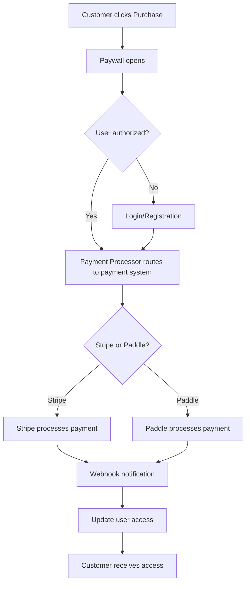

import {
  Callout,
  Cards,
  Steps,
  Table,
  Tabs
} from 'nextra/components';
import {
  ExclamationTriangleIcon,
  BookOpenIcon,
  ChartBarIcon
} from '@/components/account/icons';
import Image from 'next/image';

# Payment Processor Overview

Payment processors are the backbone of your monetization infrastructure, handling the complex interactions between your application, payment systems, and financial institutions.

## What is a Payment Processor?

A **Payment Processor** is a secure intermediary service that:

- **Connects** your application to payment systems (Stripe, Paddle)
- **Processes** customer transactions and subscription payments
- **Manages** payment flows, including checkout, billing, and refunds
- **Handles** webhook notifications and payment status updates
- **Ensures** PCI compliance and security standards

<Callout>
  Think of a payment processor as a translator between your application and the complex world of financial transactions. It abstracts away the complexity while maintaining security and reliability.
</Callout>

## How It Works



## How Payment Processors Work

<Steps>

### Step 1: Customer Initiates Payment

When a customer decides to purchase your product or subscribe to your service, they trigger a payment flow through your paywall.

### Step 2: Processor Routes Payment

The payment processor receives the payment request and routes it to the appropriate payment system (Stripe or Paddle) based on your configuration.

### Step 3: Payment System Handles Transaction

The payment system (Stripe/Paddle) processes the actual financial transaction with banks and card networks.

### Step 4: Webhook Notifications

Upon completion, the payment system sends webhook notifications back through the processor to update your application with the payment status.

### Step 5: Access Granted

Your application receives the payment confirmation and grants access to the customer.

</Steps>

## Example Use Cases

**Multi-Product Company:**

```
Stripe Processor → Product A Paywall
                 → Product B Paywall
                 → Product C Paywall
```

**Risk-Conscious Business:**

```
Main Paywall → Stripe Processor (50% traffic)
             → Paddle Processor (50% traffic)
```

## Risk Diversification with Multiple Processors

For businesses with multiple companies or those concerned about payment processor blocking, you can configure **multiple payment processors** for a single paywall.

<Callout type="warning">
  **Why diversify?** Payment processors can sometimes freeze accounts due to policy changes, compliance issues, or false fraud flags. Having multiple processors ensures business continuity.
</Callout>

### How Traffic Distribution Works

When multiple processors are connected to a paywall traffic is automatically split equally between all active processors

<Tabs items={['2 Processors', '3+ Processors']}>
  <Tabs.Tab>
    **2 Processors Configuration**
    
    - Each processor handles **50%** of payment traffic
    - If one goes down, the other handles **100%**
    - Ideal for most businesses seeking basic redundancy
    
    ```
    Paywall Traffic → 50% → Stripe Processor
                    → 50% → Paddle Processor
    ```
  </Tabs.Tab>
  <Tabs.Tab>
    **3 Processors Configuration**
    
    - Each processor handles **33.3%** of payment traffic
    - More granular risk distribution
    - Better for high-volume businesses
    
    ```
    Paywall Traffic → 33% → Stripe 1 Processor
                    → 33% → Stripe 2 Processor  
                    → 33% → Paddle Processor
    ```

     **Note:** While technically possible, more than 3 processors can add complexity without proportional benefits.

  </Tabs.Tab>
</Tabs>

### Best Practices for Multi-Processor Setup

1. **Start Simple**: Begin with 2 processors (e.g., Stripe + Paddle)
2. **Monitor Performance**: Track conversion rates and success ratios for each processor
3. **Different Providers**: Use processors from different companies for true redundancy
4. **Regional Considerations**: Consider processors that work well in your target markets
5. **Compliance Alignment**: Ensure all processors meet your compliance requirements

<Callout type="info">
  **Pro Tip**: Many successful SaaS companies use 2-3 payment processors to balance reliability with management complexity. More isn't always better - focus on quality and reliability of your chosen processors.
</Callout>

## Supported Payment Systems

Our platform currently supports integration with the following payment systems:

<Tabs items={['Stripe', 'Paddle']}>
  <Tabs.Tab>
    **Best for:** SaaS, e-commerce, international businesses
    
    **Features:**
    - Global payment method support
    - Advanced fraud protection
    - Detailed analytics and reporting
    - Strong developer tools
    - Subscription management
    
    **Supported modes:** Test and Live
    **Webhook support:** ✅ Automatic
    **Currencies:** 135+ supported
  </Tabs.Tab>
  <Tabs.Tab>
    **Best for:** Digital products, software, online services
    
    **Features:**
    - Built-in tax compliance
    - Merchant of record service
    - Global tax handling
    - Subscription billing
    - Recovery tools
    
    **Supported modes:** Sandbox and Production
    **Webhook support:** ✅ Automatic
    **Tax compliance:** ✅ Global
  </Tabs.Tab>
</Tabs>

## Getting Started

Ready to set up your payment processors? Here's your roadmap:

<Cards>
  <Cards.Card 
    title="Create Payment Processor" 
    href="/docs-v2/payment-processor/create-payment-processor"
  />
  <Cards.Card 
    title="Connect to Paywall" 
    href="/docs-v2/paywall/connect-payment-processor"
  />
  <Cards.Card 
    title="Configure Webhooks" 
    href="/docs-v2/webhooks/overview"
  />
</Cards>

## FAQ

<Accordion>
  <Accordion.Item title="Can I use the same payment processor for multiple paywalls?">
    Yes! One processor can serve multiple paywalls, making management easier and more cost-effective.
  </Accordion.Item>
  
  <Accordion.Item title="What happens if one of my processors goes down?">
    You need manually unlink payment processor in payment processor manager.
  </Accordion.Item>

  <Accordion.Item title="How do I know which processor to choose?">
    Consider your target market, business model, and compliance requirements. Stripe is great for global reach, while Paddle excels at tax compliance for digital products.
  </Accordion.Item>

  <Accordion.Item title="Is there a limit to how many processors I can connect?">
    While technically unlimited, we recommend 2-3 processors for optimal balance of redundancy and management simplicity.
  </Accordion.Item>
  
  <Accordion.Item title="Which payment processors can I choose?">
    Currently available are Stripe and Paddle, but we are working to add more options.
  </Accordion.Item>
</Accordion>
