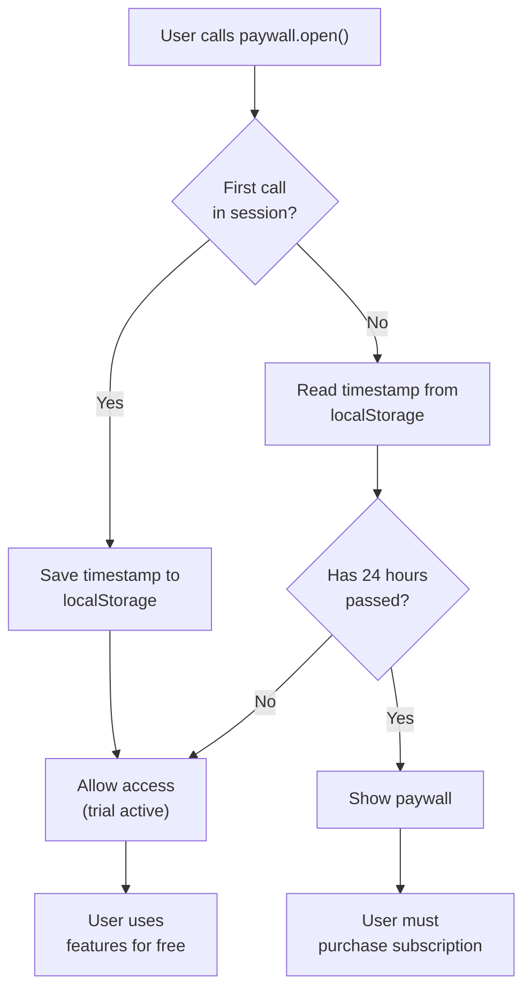
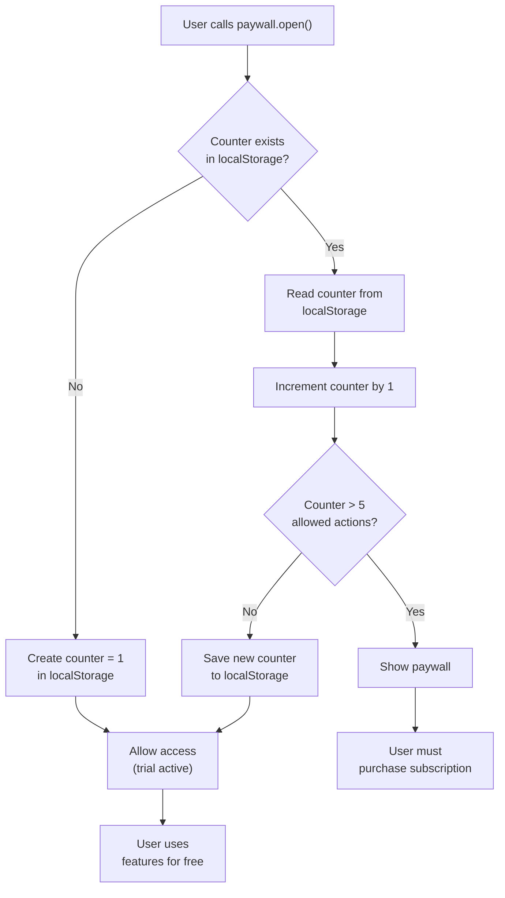

import {
  Callout,
  Cards,
  Steps,
  Table,
  Tabs
} from 'nextra/components';

# Paywall Trial

<Callout type="warning">
  This feature only available when paywall is in client mode. In server mode you can set subscription-based trial. [Read more](/docs-v2/server-side-sdk/start-checkout).
</Callout>

Learn how to configure trial periods for your paywall to give users free access before requiring payment. Paywall trials help increase conversion rates by allowing users to experience your product's value.

## Overview

Paywall trials come in two main types:

- **Before Paywall Trials** - (Only for regular paywalls) Delay showing the paywall for a specific time or number of actions
- **After Paywall Trials** - Offer free subscription access after users provide payment details

## Types of Trials

### Before Paywall Opens

<Callout type="warning">
  **Not available for tokenized paywalls:** When using tokenized paywalls, before-paywall trials are not available. Instead, trials are configured as trial tokens that are automatically deposited to users' accounts after registration.
</Callout>

These trials delay when the paywall first appears to users:

<Table>
  <thead>
    <Table.Tr>
      <Table.Th>Trial Type</Table.Th>
      <Table.Th>Description</Table.Th>
      <Table.Th>Best For</Table.Th>
    </Table.Tr>
  </thead>
  <tbody>
    <Table.Tr>
      <Table.Td>**No Trial**</Table.Td>
      <Table.Td>Paywall appears immediately</Table.Td>
      <Table.Td>Premium content, established brands</Table.Td>
    </Table.Tr>
    <Table.Tr>
      <Table.Td>**Trial Time**</Table.Td>
      <Table.Td>Paywall appears after specified hours</Table.Td>
      <Table.Td>Apps where usage patterns develop over time</Table.Td>
    </Table.Tr>
    <Table.Tr>
      <Table.Td>**Trial Actions**</Table.Td>
      <Table.Td>Paywall appears after user performs N actions</Table.Td>
      <Table.Td>Feature-based apps, tools with clear actions</Table.Td>
    </Table.Tr>
  </tbody>
</Table>

### After Paywall Opens

This trial happens after users see the paywall and provide payment details:

- **Free Trial Duration** - Users get full access for specified days before charges begin
- **Requires payment method** - Users must provide valid payment details upfront
- **Automatic billing** - Subscription starts automatically after trial ends

## How to enable trial?

<Steps>

### Step 1: Choose Trial Strategy

Decide which type of trial best fits your product:

<Tabs items={['No Trial', 'Time-Based Trial', 'Action-Based Trial']}>
  <Tabs.Tab>
    Show paywall immediately when users access premium features.
    
    **Use when:**
    - You have strong brand recognition
    - Content has immediate perceived value
    - Users understand the value proposition quickly
    
    **Configuration:** Simply select "No trial" option.
    
  </Tabs.Tab>
  <Tabs.Tab>
    Allow users to access your app for a specified number of hours before showing the paywall.
    
    **Use when:**
    - Users need time to understand value
    - Your app requires habit formation
    - Value is realized over multiple sessions
    
    **Configuration:**
    - Select "Trial time"
    - Set hours (e.g., 24, 48, 72 hours)
    - Timer starts when user first opens app
    
  </Tabs.Tab>
  <Tabs.Tab>
    Allow users to perform a specific number of actions before showing the paywall.
    
    **Use when:**
    - Your app has clear, countable actions
    - Each action provides measurable value
    - You want to demonstrate feature richness
    
    **Configuration:**
    - Select "Trial actions"
    - Set number of trial actions (e.g., 5, 10, 20)
    - Each app opening/action counts toward limit
    
  </Tabs.Tab>
</Tabs>

### Step 2: Configure Before-Paywall Trial

Set up the trial that happens before users see the paywall:

<Callout type="info">
  **Timer vs Actions:** Time-based trials work well for apps used over multiple sessions, while action-based trials work better for apps with discrete, valuable actions.
</Callout>

**Time-Based Configuration:**

- **Time in hours** - How long users can access app before paywall appears
- **Typical values** - 24 hours (1 day), 72 hours (3 days), 168 hours (1 week)
- **Starts counting** - When user first call paywall.open()

**Action-Based Configuration:**

- **Number of trial openings** - How many actions users can perform
- **Typical values** - 3-10 actions for most apps
- **Action definition** - Usually app opens, action completed

### Step 3: Configure After-Paywall Trial

Set up free trial period after users provide payment details:

**Free Trial Duration:**

- **Duration in days** - How many days of free access (0-365 days)
- **Payment required** - Users must provide valid payment method
- **Auto-billing** - Subscription starts automatically after trial
- **Typical durations** - 7 days, 14 days, 30 days

</Steps>

## Trial Implementation Details 

### Time-Based Trial Flow

When a user performs a "paid action" and `paywall.open()` is called:

**Technical Details:**

1. **First opening** - timestamp is saved to browser's `localStorage` or `chrome storage`
2. **Subsequent openings** - check if the set time period has passed (e.g., 24 hours)
3. **After expiration** - `paywall.open()` returns an error with `visibility_reason = 'trial-time'`
4. **Data storage** - trial data is stored locally in the user's browser

### Action-Based Trial Flow

Similar flow for action-based trial, but tracks action counter instead:

**Technical Details:**

1. **Action counter** - stored in `localStorage` or `chrome storage` and incremented with each call
2. **Limit check** - when exceeding the set number of actions (e.g., 5)
3. **After exceeding** - `paywall.open()` returns an error with `visibility_reason = 'trial-actions'`
4. **Counter reset** - only happens when localStorage is cleared or on fresh installation

<Callout type="warning">
  **Important:** Trial data is stored in the browser's `localStorage` or `chrome storage`. If the user clears their browser or uses incognito mode, the trial may reset.
</Callout>

## Trial Strategy Best Practices

### Before-Paywall Trials

1. **Match trial to user journey** - Consider how users typically discover value
2. **Don't make trials too long** - Risk users forgetting about your app
3. **Track trial effectiveness** - Monitor conversion rates for different trial lengths
4. **Provide value quickly** - Ensure users see benefits within trial period

### After-Paywall Trials

1. **Require payment upfront** - Reduces trial abuse and improves conversion
2. **Communicate clearly** - Tell users exactly when billing will start
3. **Send reminders** - Notify users before trial ends
4. **Make cancellation easy** - Builds trust and reduces support burden

## Next Steps

After configuring trials:

<Cards>
  <Cards.Card 
    title="Paywall with trial guide" 
    href="/docs-v2/guide/subscription-saas"
  />
  <Cards.Card 
    title="Create customer portal" 
    href="/docs-v2/paywall/customer-portal"
  />
  <Cards.Card 
    title="Create offer" 
    href="/docs-v2/offers/create-offer"
  />
</Cards>
