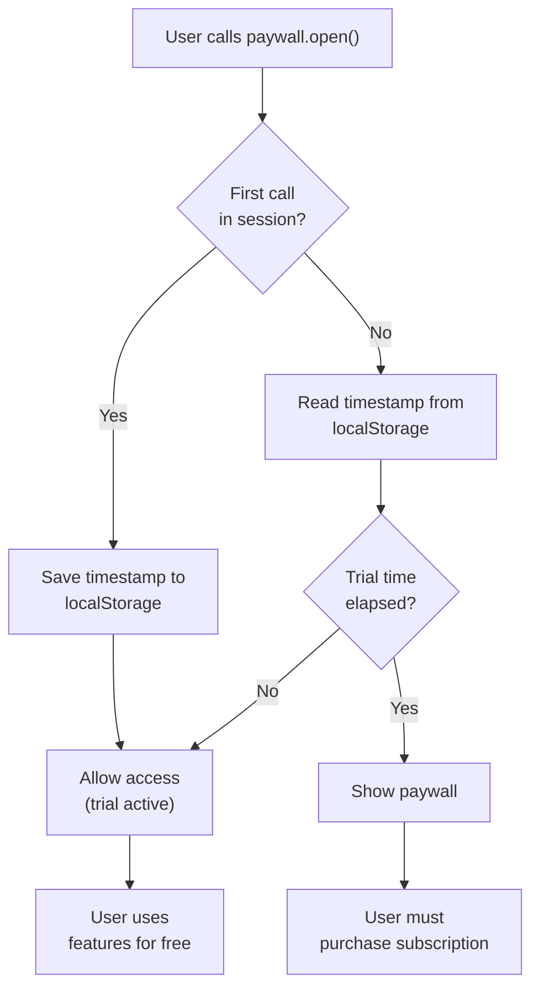
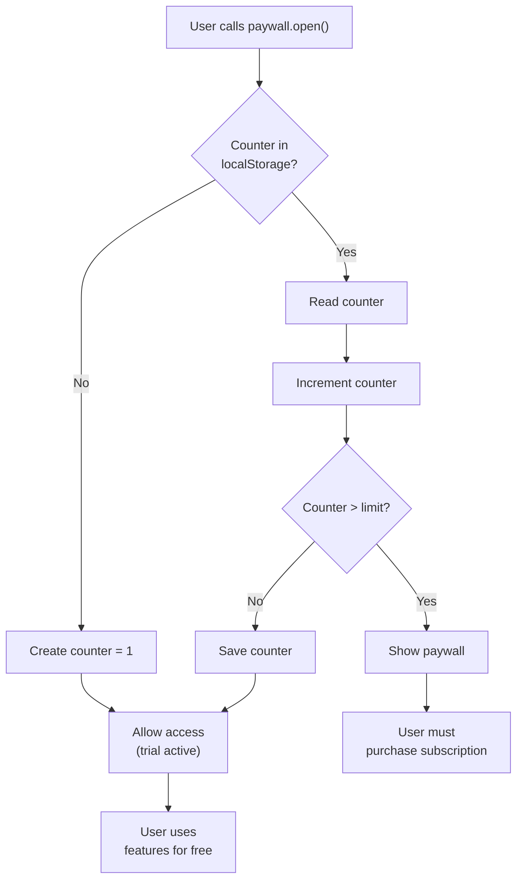

import { Callout, Cards } from 'nextra/components';

# Trial Implementation (SDK v2)

How before-paywall trial works in the legacy Client-Side SDK (`wall.x.x.js`). Concept and dashboard configuration: [Paywall → Trial](/docs-v2/paywall/trial). For SDK v3, see [SDK v3 → Trial](/docs-v2/sdk-v3/trial).

<Callout type="info">
  **Regular paywalls only.** Tokenized paywalls deposit trial *tokens* into the user's balance instead — they don't use this client-side counter. See [Tokenization](/docs-v2/paywall/tokenization).
</Callout>

## Time-Based Trial Flow

When the user performs a "paid action" and `paywall.open()` is called:



**Technical details:**

1. **First opening** — timestamp is saved to `localStorage` (or `chrome.storage` in extensions).
2. **Subsequent openings** — SDK checks whether the configured trial duration has elapsed.
3. **After expiration** — `paywall.open()` rejects with an error carrying `visibility_reason = 'trial-time'`.
4. **Storage location** — trial state is local to the device; clearing storage resets the trial.

## Action-Based Trial Flow

Same as above, but tracks a counter rather than a timestamp:



**Technical details:**

1. **Counter** stored in `localStorage` / `chrome.storage` and incremented on each `paywall.open()`.
2. **Limit check** — once the counter exceeds the configured number (e.g. 5).
3. **After exceeding** — `paywall.open()` rejects with `visibility_reason = 'trial-actions'`.
4. **Reset** — only by clearing storage or fresh installation.

## Handling Trial in Code

Use `paywall.getTrialInfo()` to read current trial state without triggering the modal:

```javascript
const trial = await paywall.getTrialInfo();
if (trial.type === 'time') {
  const msLeft = trial.expirationEnd - Date.now();
  showTrialBanner(`Trial: ${Math.ceil(msLeft / 3600000)} h left`);
} else if (trial.type === 'actions') {
  showTrialBanner(`${trial.actionsLeft} free actions remaining`);
}
```

Full signature: [`paywall.getTrialInfo()`](/docs-v2/sdk-v2/client-side/get-trial-info).

When trial expires and `paywall.open()` rejects, branch by `visibility_reason`:

```javascript
try {
  await paywall.open({ resolveEvent: 'success-purchase' });
  unlockFeature();
} catch (err) {
  switch (err.visibility_status_reason) {
    case 'trial-time':
    case 'trial-actions':
      // trial just expired — paywall is now shown to the user
      break;
    case 'active-payment-found':
      unlockFeature(); // already subscribed
      break;
  }
}
```

## Limitations

- **Device-bound** — clearing browser data resets the trial.
- **No server-side enforcement** — the trial check happens in the browser. A determined user can wipe storage to repeat the trial.
- **No incognito protection** — private mode starts with empty storage, so trial restarts.

For server-enforced trials, use **after-paywall trials** (free days after payment method capture) — those are stored on the platform and survive storage clears. See dashboard → paywall → trial config.

## See Also

<Cards>
  <Cards.Card title="Concept & dashboard config" href="/docs-v2/paywall/trial" />
  <Cards.Card title="Get Trial Info" href="/docs-v2/sdk-v2/client-side/get-trial-info" />
  <Cards.Card title="Open Paywall" href="/docs-v2/sdk-v2/client-side/open" />
  <Cards.Card title="SDK v3 equivalent" href="/docs-v2/sdk-v3/trial" />
</Cards>
