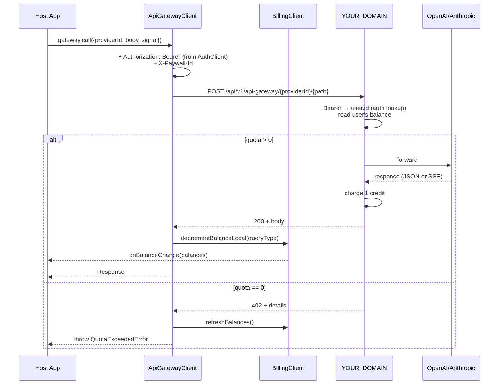

import { Callout, Cards, Table } from 'nextra/components';

# API Gateway

`ApiGatewayClient` is the SDK 3.0 client for metered AI calls **from the browser**: SPA, Chrome extension, Telegram Mini App. The proxy forwards the request to OpenAI/Anthropic/any configured HTTP API using server-held keys, debits one credit from the user's balance for the provider's `query_type`, and returns the response as-is (including `text/event-stream`).

The point of routing through us is that **your provider API keys never leave our server**. In a browser-only app you can't ship `OPENAI_API_KEY` to the client; the gateway is what makes metered AI possible without a backend of your own.

<Callout type="info">
  **When to use.** Only when your paywall has `tokenization` enabled and at least one [API Provider](/docs-v2/api-provider/overview) configured. Without them `/balances` returns an empty array and `gateway.call()` fails with `provider-disabled`.
</Callout>

<Callout type="warning">
  **Headless / your own backend?** Don't use `ApiGatewayClient` server-side — your backend already has the provider keys and can call OpenAI/Anthropic directly with lower latency. Debit credits after success via [`withdrawTokens`](/docs-v2/sdk-v3/headless-server#token-withdrawal) (one POST with `X-Api-Key`). The gateway exists for browser scenarios; routing through it from your own server adds a network hop for no benefit.
</Callout>

## Quick start

```ts
import {
  AuthClient,
  BillingClient,
  QuotaExceededError
} from '@monetize.software/sdk/core';

const auth = new AuthClient({ paywallId: 'pw_123' });
const billing = new BillingClient({ paywallId: 'pw_123', auth });

// The factory automatically wires Bearer and balance state from this billing.
const gateway = billing.createApiGatewayClient();

billing.onBalanceChange((balances) => {
  console.log('Quota:', balances); // [{ type: 'standard', count: 42 }, ...]
});

try {
  const res = await gateway.call({
    providerId: 'prov_openai_chat',
    path: 'v1/chat/completions',
    body: {
      model: 'gpt-4',
      messages: [{ role: 'user', content: 'Hello' }]
    }
  });
  const data = await res.json();
} catch (e) {
  if (e instanceof QuotaExceededError) {
    paywall.open(); // user is out of quota — show upgrade
  } else throw e;
}
```

## Principles

- **Raw `Response`.** `gateway.call()` returns a plain `fetch` Response, not a wrapper. The caller decides: `.json()`, `.text()`, `.body.getReader()`, async-iter — everything works out of the box. The SDK doesn't ship its own SSE parser — parse raw chunks yourself or use your existing streaming library.
- **Authorization from `AuthClient`.** If billing was created with `auth`, the gateway automatically sends `Authorization: Bearer <access_token>`; lazy refresh works just like for every other SDK request.
- **Optimistic balance decrement.** On success, `decrementBalanceLocal()` reduces `cachedBalances` for the matching `query_type` immediately; listeners get the update instantly. On a 402 the SDK auto-fires `refreshBalances()` so the UI gets a fresh snapshot.
- **402 → `QuotaExceededError`.** The backend returns 402 with `details.balances`, `details.queryType`, `details.currentBalance` — the SDK parses and throws a typed error. PaywallUI catches it automatically and opens the upgrade modal; a headless caller handles it itself.

## Streaming (SSE)

The backend proxy passes `text/event-stream` responses through unchanged, with the same chunks the provider sent.

```ts
const res = await gateway.call({
  providerId: 'prov_openai_chat',
  path: 'v1/chat/completions',
  body: {
    model: 'gpt-4',
    stream: true,
    messages: [{ role: 'user', content: 'Tell me a story' }]
  },
  signal: controller.signal
});

const reader = res.body!.getReader();
const decoder = new TextDecoder();
while (true) {
  const { done, value } = await reader.read();
  if (done) break;
  const chunk = decoder.decode(value, { stream: true });
  // chunk is raw SSE: "data: {...}\n\n"; parse as usual
}
```

`signal: AbortSignal` is supported — `controller.abort()` cancels upstream, the backend cancels the provider request and logs the stream as `aborted`.

## Balances

`BillingClient` keeps balances in memory with a 5-second TTL plus a listener. You can read them manually:

```ts
const balances = await billing.getBalances();
// [{ type: 'free', count: 100 }, { type: 'standard', count: 9 }]

const sync = billing.getCachedBalances(); // null if never loaded

const off = billing.onBalanceChange((balances) => {
  /* re-render counter */
});
off(); // unsubscribe

await billing.refreshBalances(); // force re-fetch
```

After every successful `gateway.call()` balances are decremented locally, without a second round-trip to the server. The only authoritative source is the server-side balance; the local cache is a UX facade.

## `gateway.call()` options

<Table>
  <thead>
    <Table.Tr>
      <Table.Th>Field</Table.Th>
      <Table.Th>Type</Table.Th>
      <Table.Th>What it does</Table.Th>
    </Table.Tr>
  </thead>
  <tbody>
    <Table.Tr>
      <Table.Td>`providerId`</Table.Td>
      <Table.Td>`string`</Table.Td>
      <Table.Td>API provider UUID from the dashboard ([API Providers](/docs-v2/api-provider/overview) section)</Table.Td>
    </Table.Tr>
    <Table.Tr>
      <Table.Td>`path`</Table.Td>
      <Table.Td>`string?`</Table.Td>
      <Table.Td>Path after the provider (`v1/chat/completions`, `messages`, ...). Concatenated via `/`</Table.Td>
    </Table.Tr>
    <Table.Tr>
      <Table.Td>`method`</Table.Td>
      <Table.Td>`'GET' \| 'POST'`</Table.Td>
      <Table.Td>Defaults to `POST`</Table.Td>
    </Table.Tr>
    <Table.Tr>
      <Table.Td>`body`</Table.Td>
      <Table.Td>`unknown \| FormData \| Blob \| ReadableStream \| string`</Table.Td>
      <Table.Td>Object → JSON.stringify + `Content-Type: application/json`. FormData/Blob — the browser sets the boundary. ReadableStream/string — passed through</Table.Td>
    </Table.Tr>
    <Table.Tr>
      <Table.Td>`headers`</Table.Td>
      <Table.Td>`Record<string,string>`</Table.Td>
      <Table.Td>Extra headers. Doesn't overwrite `Authorization` or `X-Paywall-Id`</Table.Td>
    </Table.Tr>
    <Table.Tr>
      <Table.Td>`signal`</Table.Td>
      <Table.Td>`AbortSignal`</Table.Td>
      <Table.Td>Cancel the request (important for long streams)</Table.Td>
    </Table.Tr>
  </tbody>
</Table>

## `QuotaExceededError`

```ts
class QuotaExceededError extends PaywallError {
  code: 'not_enough_queries';
  status: 402;
  balances: Balance[];          // every balance the user has at the moment of 402
  queryType: string;             // which query_type ran out
  currentBalance: Balance | null; // entry for queryType, usually { type, count: 0 }
}
```

Standard host-app handler:

```ts
import { QuotaExceededError } from '@monetize.software/sdk/core';

try {
  const res = await gateway.call({ providerId, body });
  /* ... */
} catch (e) {
  if (e instanceof QuotaExceededError) {
    // Balances have already been refreshed via refreshBalances() — onBalanceChange
    // emitted a new snapshot already. Open the paywall.
    paywall.open();
    return;
  }
  throw e;
}
```

## What's under the hood



## Related pages

<Cards>
  <Cards.Card
    title="API Provider Overview"
    href="/docs-v2/api-provider/overview"
    description="How to configure an API provider on the platform"
  />
  <Cards.Card
    title="Authentication"
    href="/docs-v2/sdk-v3/auth"
    description="AuthClient — Bearer tokens for gateway calls"
  />
  <Cards.Card
    title="BillingClient"
    href="/docs-v2/sdk-v3/bootstrap"
    description="Bootstrap, identity and balance state for the UI"
  />
  <Cards.Card
    title="Headless / server-side"
    href="/docs-v2/sdk-v3/headless-server#token-withdrawal"
    description="From your own backend — call providers directly and debit credits via withdrawTokens"
  />
</Cards>
